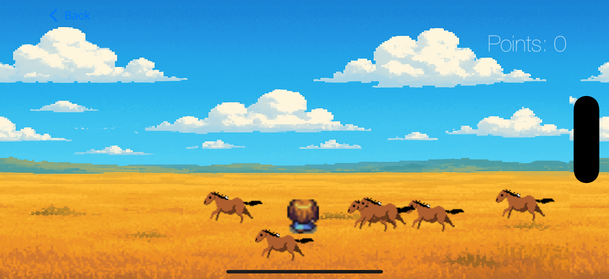

# Animated Game with SpriteKit

## Description
This project is a 2D animated game built using SpriteKit. It features animated characters, looping backgrounds, and a dynamic camera system. The game is designed to be modular and extendable, making it easy to add new features and animations.





## Features
- Animated player character with directional movement.
- Looping background for an infinite scrolling effect.
- Dynamic camera that follows the player.
- Modular design with protocols for reusability.

## Requirements
- Xcode 12 or later.
- Swift 5.0 or later.
- macOS 10.15 or later.

## Installation
1. Clone the repository:
   ```bash
   git clone https://github.com/herbstsonne/WildHorses.git

